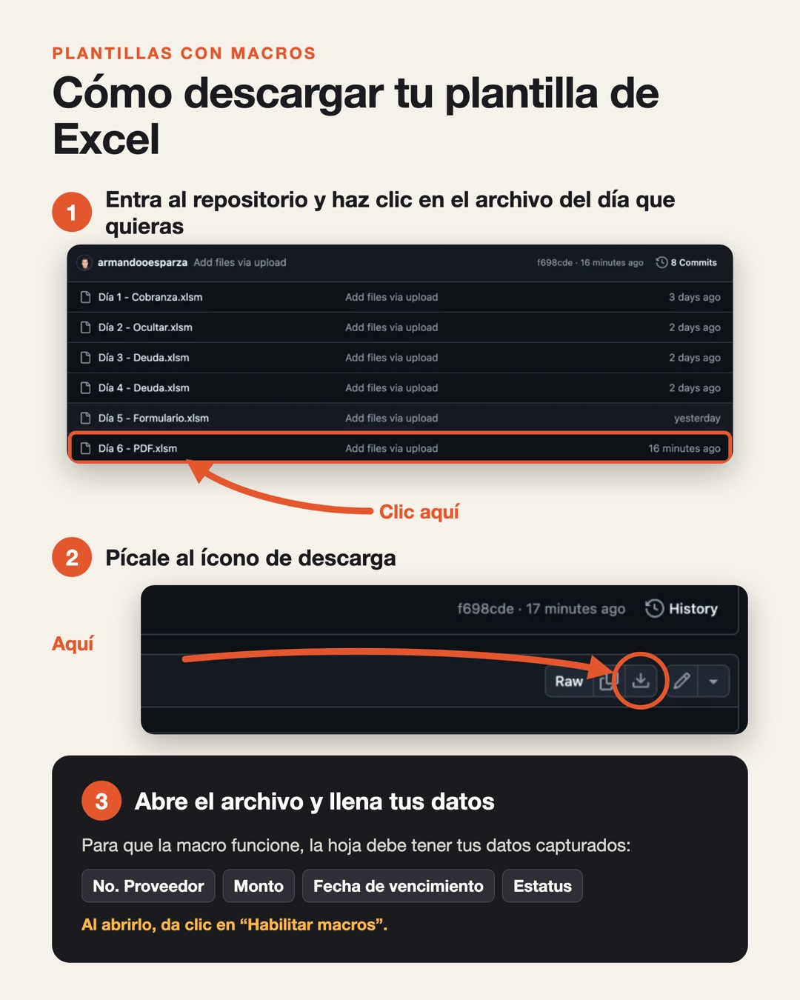

# Plantillas con Macros

Plantillas de Excel con macros para automatizar procesos de pagos y cobranza.

## Cómo descargar una plantilla

**Paso 1:** Haz clic en el archivo del día que quieras, por ejemplo **Día 6 - PDF.xlsm**.

**Paso 2:** Pícale al ícono de descarga, arriba a la derecha junto al botón *Raw*.

**Paso 3:** Abre el archivo, da clic en **Habilitar macros** y llena tus datos: No. Proveedor, Monto, Fecha de vencimiento y Estatus. Sin datos, la macro no tiene nada que procesar.
